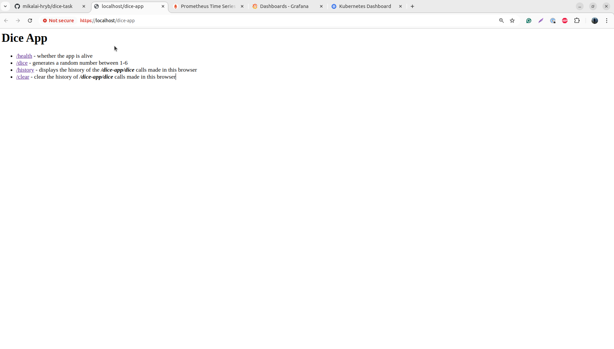
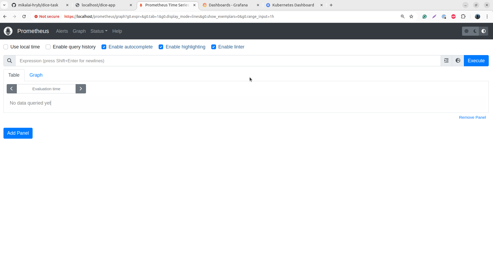
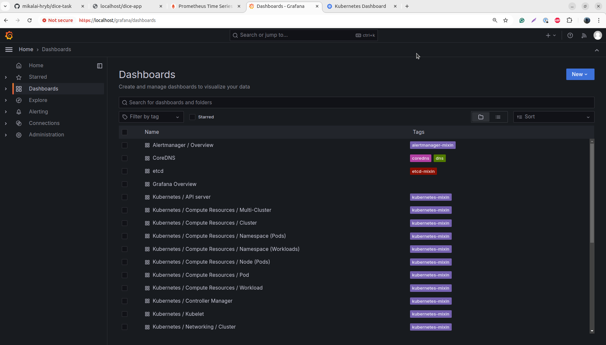
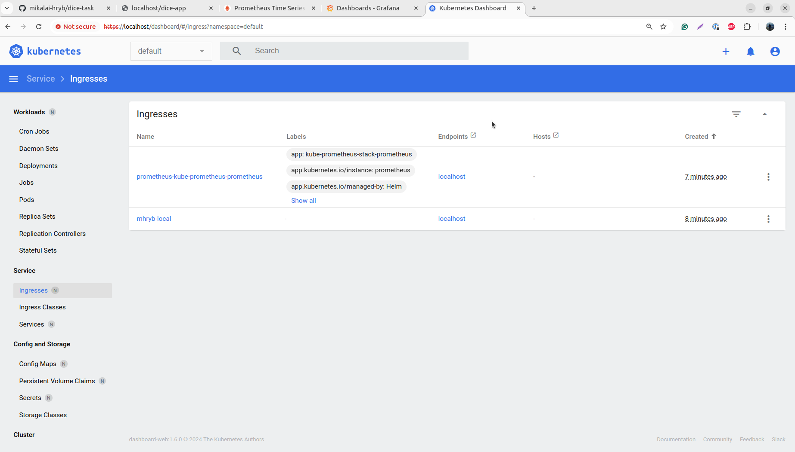

# Dice Task

In this repository, you can find a simple Python application and a Terraform configuration that deploys this application as well as supporting tools (Prometheus, Grafana, and Kubernetes Dash)

## Prerequisites

* [Kind 0.23+](https://kind.sigs.k8s.io/docs/user/quick-start/#installation)
* [Docker 27.3+](https://docs.docker.com/engine/install/)
* [Helm 3.15+](https://helm.sh/docs/intro/install/)
* [Terraform 1.9+](https://developer.hashicorp.com/terraform/install)

## Preview

1. Check the video

    

2. Dice App

    

3. Prometheus

    

4. Grafana

    

5. Dashboard

    

## Deployment

1. Go to the folder with Terraform configuration

    ```bash
    cd tf
    ```

2. Configure Terraform configuration ([terraform.tfvars](./tf/terraform.tfvars)) if needed

3. Deploy infrastructure

    > **_NOTE:_**  We are forced to use 2-step "apply" operation because of [this](https://github.com/hashicorp/terraform-provider-kubernetes/issues/1775#issuecomment-1193859982)

    ```bash
    terraform init && \
    terraform apply -auto-approve -target kind_cluster.this && \
    terraform apply -auto-approve
    ```

    > **_NOTE:_** Try to run the command above one more time if any errors appear

## Check

1. Get handy URLs (you should have seen them in the outputs from the previous step)

    ```bash
    terraform output
    ```

2. Get the token for the Kubernetes Dashboard

    ```bash
    terraform output -raw admin_user_token
    ```

    OR

    ```bash
    kubectl get secret admin-user  -o jsonpath={".data.token"} | base64 -d
    ```

3. Get credentials for the Grafana

    ```bash
    terraform output -json grafana_credentials | jq .
    ```

    OR

    ```bash
    kubectl get secret prometheus-grafana  -o jsonpath={".data.admin-user"} | base64 -d
    kubectl get secret prometheus-grafana  -o jsonpath={".data.admin-password"} | base64 -d
    ```

4. Get content of the logs file

    ```bash
    kubectl logs deployment/$(terraform output -raw dice_deployment_name) -c sidecar
    ```

## Cleanup

1. Go to the folder with Terraform configuration

    ```bash
    cd tf
    ```

2. Destroy infrastructure

    ```bash
    terraform destroy -auto-approve
    ```

## Faced issues

1. Issue with "target_port"

    It appears that the "kubernetes_service.spec.port.target_port", if not specified, keeps the previous value of "kubernetes_service.spec.port.port" in the state file when "kubernetes_service.spec.port.port" is changed.

2. The "kubernetes_deployment_v1" resource [does not support sidecar containers (restart_policy option)](https://github.com/hashicorp/terraform-provider-kubernetes/issues/2446)

3. Issues with deploying Kubernetes manifest with multiple resources

    > **_NOTE:_** The following terraform configuration sample does not work

    ```hcl
    data "http" "ingress_nginx_crd" {
      url = "https://raw.githubusercontent.com/kubernetes/ingress-nginx/main/deploy/static/provider/kind/deploy.yaml"
    }

    locals {
      ingress_nginx_crds = provider::kubernetes::manifest_decode_multi(data.http.ingress_nginx_crd.response_body)
    }

    resource "kubernetes_manifest" "ingress_nginx_crd" {
      for_each = {
        for manifest in local.ingress_nginx_crds :
        "${manifest.kind}--${manifest.metadata.name}" => manifest
      }

      manifest = each.value
    }
    ```

4. 2-step terraform apply operation when "kind_cluster" and "kubernetes_manifest" resources are in one configuration

## Potential improvements

1. Use multi node kind cluster.
2. Schedule applications into "worker" nodes instead of keeping everything within the "control plane" node.
3. Set requests and limits for Pods.
4. Move Prometheus, Grafana, Kubernetes Dashboard resources to appropriate namespaces.
5. Separate the deployment of the cluster and applications into separate modules.
